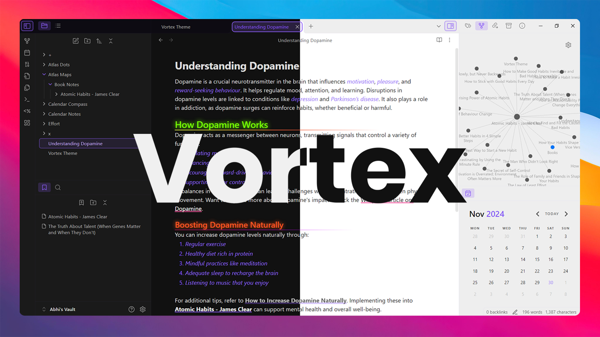

<h1 align="center">Obsidian Theme: Luminex</h1>

# ⚠️ Luminex is Now Archived  

Luminex has evolved into **[Vortex](https://github.com/abhimangs/obsidian-vortex)**, a completely reimagined Obsidian theme with exciting new features and enhancements!  

## 🚀 What's New in Vortex:  
- 🎨 **Customizable Accent Colors**: Personalize your workspace with infinite color possibilities.  
- 🖋️ **Enhanced Heading Styles**: Neon glow effects and gradient underlines for stunning aesthetics.  
- 🔗 **Interactive Links**: Smooth hover animations for a dynamic user experience.  
- 💬 **Custom Callouts**: Stylish callouts with built-in icons to make your notes visually appealing.  
- 🌗 **Improved Light and Dark Modes**: Seamless transitions and modern styling for both modes.  

Upgrade to **Vortex** today for a superior note-taking experience! 🎉  

## Feedback

For any issues or feature requests, please open an issue in the repository.
Email: theabhimangs@gmail.com
---

*Enjoy your experience with the Luminex theme!*
